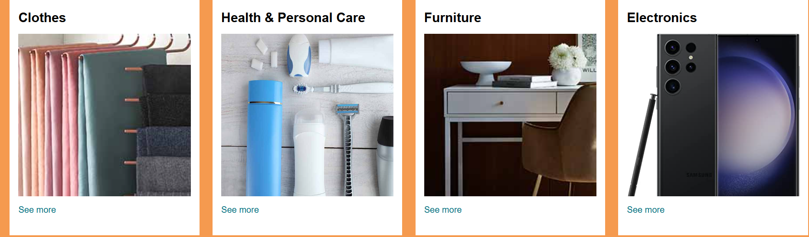
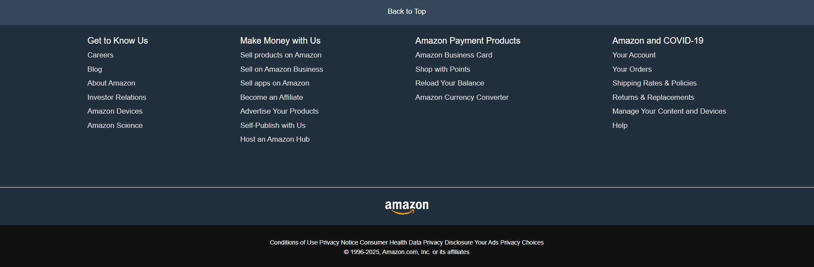

# 🛒 Amazon Homepage UI Clone (HTML + CSS)
A clean and responsive **Amazon homepage clone** built using **pure HTML and CSS**. 
This project helped me practice layout building, Flexbox, structured UI design, and front-end development fundamentals.

 

---

## 📸 Project Screenshots

### 🖼️ **Header**

 

### 🛍️ **Product Section**

 

### 📦 **footer**

 

---

 

## 🚀 Features
- 🧭 Amazon-style **navigation bar** 
- 🖼️ Hero banner section 
- 🛍️ Product category boxes & cards 
- 🏷️ Product grid layout 
- 📦 Footer layout similar to Amazon 
- 📱 Basic responsive design 
- 🎨 Clean and structured CSS code 

 

---

## 🛠️ Tech Stack
- **HTML5** 
- **CSS3** 
- **Flexbox** 
- **Responsive Design** 
- **Google Fonts / Icons (optional)** 

